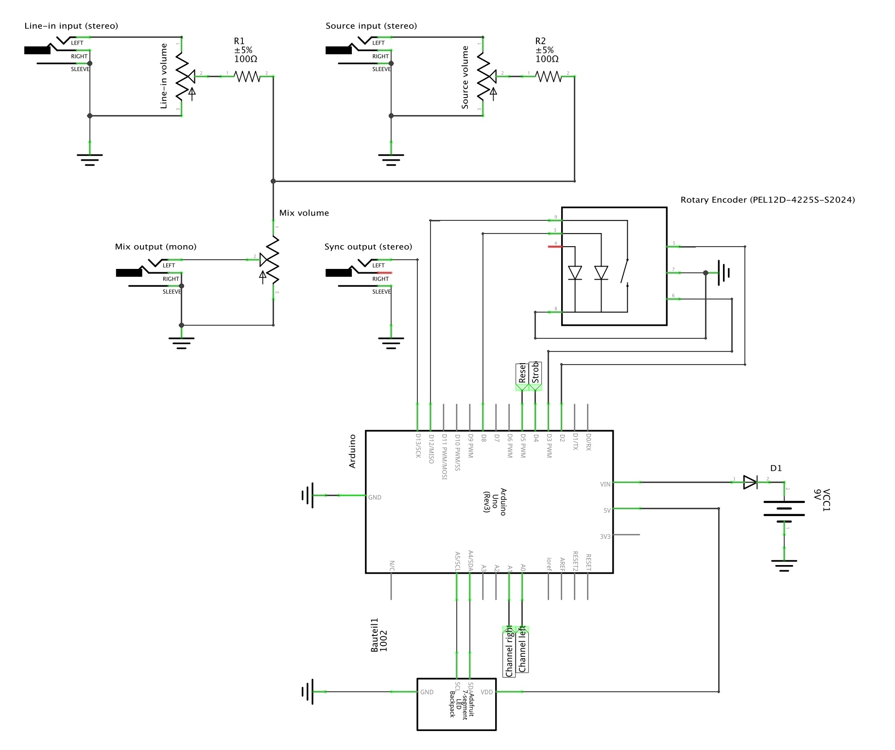

Clockxer
======

### An analog sync clock with adjustable BPM and 2-channel passive mixer.

------
#### 💾 Software

Under the hood is an [Arduino Uno](https://store.arduino.cc/usa/arduino-uno-rev3) along with a [SparkFun Spectrum Shield](https://www.sparkfun.com/products/13116) ~~(for audio analysis)~~. Both of these are probably a bit overkill given the way I'm implementing things. But, I'm more comfortable with software than hardware and I had an Arduino sitting idle on my desk.

The Arduino handles the logic for reading the values from the rotary encoder ~~and analyzing the audio data for beat detection~~ (TODO 😄). There are two libraries that I leaned on for this.

**Third party libraries**
* [MSGEQ7](https://github.com/NicoHood/MSGEQ7) which makes it much easier to pull audio data from the [MSGEQ7](https://www.sparkfun.com/datasheets/Components/General/MSGEQ7.pdf) chips which are part of the [Spectrum Shield](https://www.sparkfun.com/products/13116).
* [Adafruit LED Backpack](https://github.com/adafruit/Adafruit_LED_Backpack) which handles all of the magic to display BPM value on the segment display.
* [Protothreads library](https://code.google.com/archive/p/arduinode/downloads) A library for manaing [protothreads](http://harteware.blogspot.com/2010/11/protothread-powerfull-library.html) for Arduino.

------
#### 🎛️ Hardware

The hardware for this is pretty simple to put together. However, I can nearly guarantee that the way I've done it is not the most efficient way. For example, the [Spectrum Shield](https://www.sparkfun.com/products/13116) is a bit overkill and I could have use a singular MSGEQ7 IC. Equally, the Arduino itself is probably unnecessary for an actual electrical engineer. If you have suggestions, make a [pull request]() 🙏. Within the [hardware]() folder you'll find [Fritzing]() schematic files (or consult the JPEG below).

| Line-in (source)                                           | Line-in                                                      | BPM                                                          | Sync                                                         | Mix                                                          |
| ------------------------------------------------------------ | ---------------------------------------------------------- | ------------------------------------------------------------ | ------------------------------------------------------------ | ------------------------------------------------------------ |
| Input: This audio analyzed by the MSGEQ7 chips, passed through to the **sync** output, and merged with **line-in** input. | Input: is passed through and merged with **source** input. | Knob: Set BPM for **sync** output. Push to toggle whether **sync** output is active. | Output: A 5V PP signal for syncing analog devices to the given BPM. | Output: Merged audio (mono) signal of **source** and **line-in** inputs. |
| Volume: Adjust the volume of the **source** input.           | Volume: Adjust the volume of the **line-in** input.        |                                                              |                                                              | Volume: Adjust the volume of the **mix** output.             |

**Schematic**
How to solder everything together.

**Parts list**
The components for this project can be obtained through a few sources [Arduino](https://arduino.cc), [Adafruit](https://adafruit.com), [Sparkfun](https://sparkfun.com), and [DigiKey](https://digikey.com).

| Qty  | Part                          | Ref No.                                                      |
| ---- | ----------------------------- | ------------------------------------------------------------ |
| 1    | Arduino Uno                   |                                                              |
| 1    | Spectrum Shield               | [DEV-13116](https://www.sparkfun.com/products/13116)         |
| 1    | Enclosure 119.5mm x 94mm x 42mm | [1590BBSBK](https://www.digikey.com/scripts/DkSearch/dksus.dll?Detail&itemSeq=251416092&uq=636536516904889851) |
| 1    | Rotary Encoder switch and LED | [PEL12D-4225S-S2024](https://www.digikey.com/scripts/DkSearch/dksus.dll?Detail&itemSeq=251416645&uq=636536516904889851) |
| 1    | Transparent knob              | [COM-10597](https://www.digikey.com/scripts/DkSearch/dksus.dll?Detail&itemSeq=251417859&uq=636536516904899851) |
| 3    | 10k Logarithmic Potentiometer | [PDB181-K420K-103A2](https://www.digikey.com/scripts/DkSearch/dksus.dll?Detail&itemSeq=251416999&uq=636536516904889851) |
| 3    | Volume knob                  | [1568-1606](https://www.digikey.com/scripts/DkSearch/dksus.dll?Detail&itemSeq=251417794&uq=636536516904889851) |
| 3    | 1/4" (6.35mm) Stereo input jack | [SC1317](https://www.digikey.com/product-detail/en/switchcraft-inc/112BX/SC1317-ND/1217816) |
| 1    | 4-Digit 7-Segment Display w/I2C Backpack | [1002](https://www.adafruit.com/product/1002)     |
| 1    | 9V Connector | [36-232](https://www.digikey.com/product-detail/en/keystone-electronics/232/36-232-ND/303804) |
| 1    | 50V 1A Diode (1N4001)       | [641-1310-1](https://www.digikey.com/product-detail/en/comchip-technology/1N4001-G/641-1310-1-ND/1979675) |

**Enclosure**

Of course you can use any enclosure you want, but I opted for a [diecast aluminium (black) case](https://www.digikey.com/product-detail/en/hammond-manufacturing/1590BBSBK/1590BBSBK-ND/3869214). It's compact (119.5mm x 94mm x 42mm), but still has plenty of room for the Arduino and a 9-volt battery. I've created a [base](https://www.tinkercad.com/things/crAZhWdCvB1-clockxer-enclosure-base) that sits inside the enclosure to keep the internal components in place. For mounting the 7 Segment display I've created a [cowling](https://www.tinkercad.com/things/hzLmspQi8GF-clockxer-led-cowling) to mask the terribly cut square hole.

------
#### 🎩 Tip-of-the-hat

Without [Google](https://google.com) I wouldn't have stumbled across the following sites, which were helpful in a number of ways.

* [Electronoize Playshop: Dividers, Volume Controls, Mixers, Filters, Switches...](http://www.fluxmonkey.com/electronoize/passiveDividersFilters.htm)
* [Timer, Counter und Interrupts | heise Developer](https://www.heise.de/developer/artikel/Timer-Counter-und-Interrupts-3273309.html)
* [bildr  » Rotary Encoder + Arduino](http://bildr.org/2012/08/rotary-encoder-arduino/)
* [How to "Multithread" an Arduino (Protothreading Tutorial)](https://create.arduino.cc/projecthub/reanimationxp/how-to-multithread-an-arduino-protothreading-tutorial-dd2c37)
* [protothread, a powerfull library[sic]](http://harteware.blogspot.com/2010/11/protothread-powerfull-library.html)

------
#### 📜 License

[MIT](https://opensource.org/licenses/MIT)
